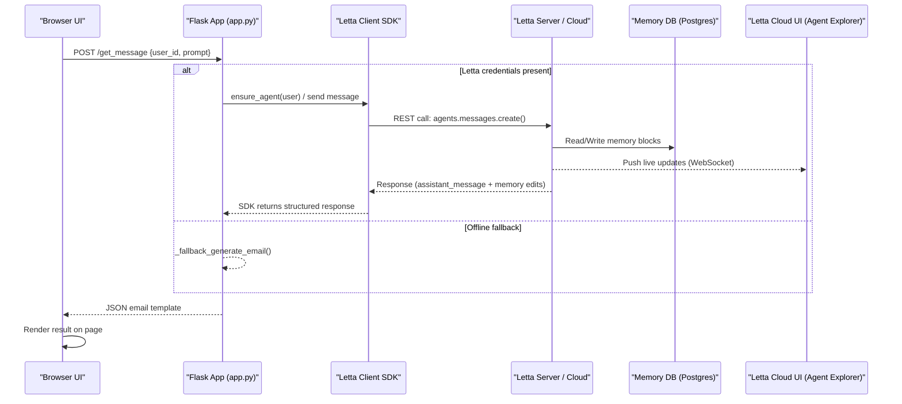

# System Overview

The diagram below illustrates how the pieces of the personalized email demo interact— from the browser request all the way to Letta Cloud and back.

```mermaid
sequenceDiagram
    participant B as "Browser UI"
    participant F as "Flask App (app.py)"
    participant LC as "Letta Client SDK"
    participant LS as "Letta Server / Cloud"
    participant M as "Memory DB (Postgres)"
    participant UI as "Letta Cloud UI (Agent Explorer)"

    B->>F: POST /get_message {user_id, prompt}
    alt Letta credentials present
        F->>LC: ensure_agent(user) / send message
        LC->>LS: REST call: agents.messages.create()
        LS->>M: Read/Write memory blocks
        LS-->>UI: Push live updates (WebSocket)
        LS-->>LC: Response (assistant_message + memory edits)
        LC-->>F: SDK returns structured response
    else Offline fallback
        F-->>F: _fallback_generate_email()
    end
    F-->>B: JSON email template
    B->>B: Render result on page
``` 